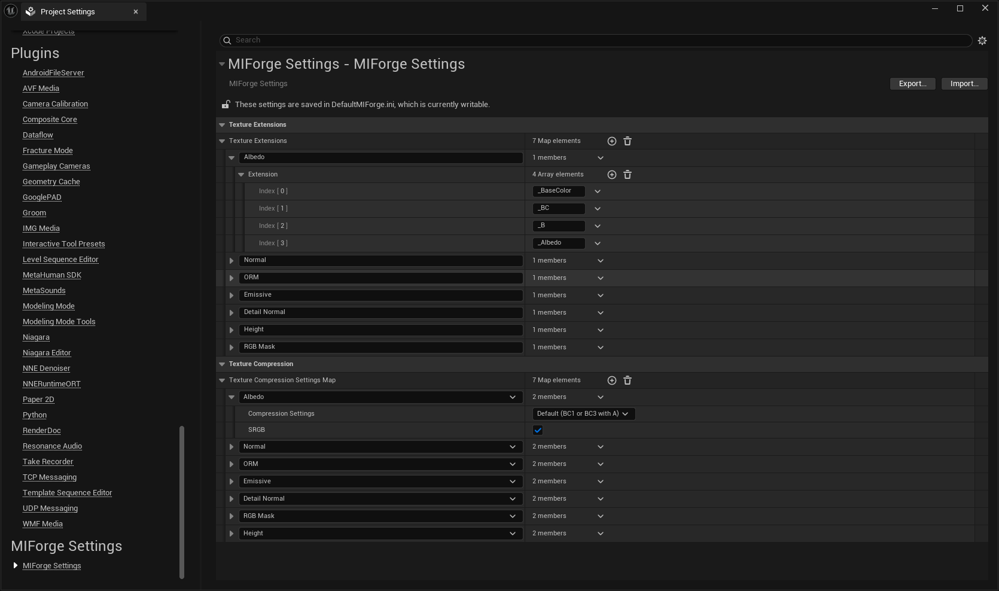
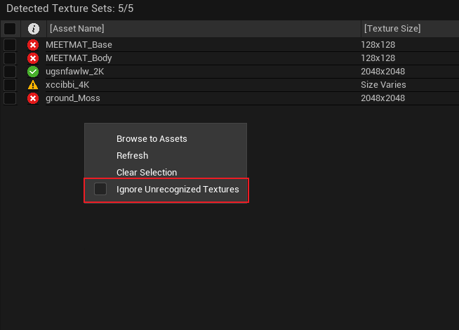
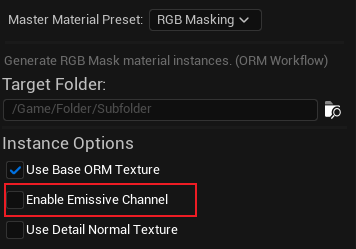
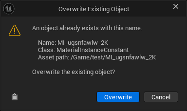
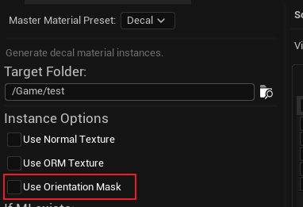
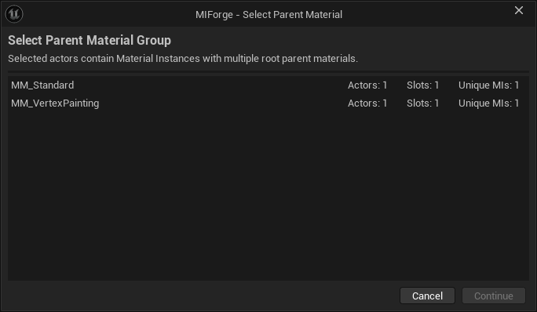

# MIForge Conventions

This document covers important workflow conventions, recommended usage, and several special cases when working with MIForge.

## 1. Texture Naming and Compression Settings

MIForge's texture naming suffixes and compression conventions can be configured here:

**Unreal Editor → Project Settings → MIForge Settings**

---

## 2. Texture Set Mode

**Texture Set Mode is strongly recommended over Individual Mode** for most workflows.

Texture Set Mode allows MIForge to group related textures automatically and provides a more consistent validation and generation workflow.

---

## 3. Unrecognized Textures

Texture sets containing unrecognized textures will display a warning, but this **does not block Material Instance generation**.

If you prefer not to see these warnings, you can disable them by:

**Right-clicking the texture list panel → Enable "Ignore Unrecognized Textures"**

---

## 4. RGB Masking Preset — Emissive Channel

When using the **RGB Masking** preset, enabling the **Emissive** option indicates that part of the material should be emissive.

The emissive mask should be packed into the **Alpha channel** of the RGB mask texture.

The emissive color itself should currently be configured manually in the generated Material Instance.

> A future version may provide an additional option for controlling emissive color through a separate texture.

---

## 5. Undo / Redo Limitations

MIForge supports Undo / Redo for Material Instance generation, but there are currently several known limitations.

After undoing generated Material Instances, you may need to select another folder and then return to the original folder to refresh the UI before the removed instances completely disappear from the list.

If Unreal displays a window like this when recreating a Material Instance:

Selecting **Overwrite** will allow generation to continue.

However, after doing so, MIForge might no longer be able to correctly undo the creation of that particular Material Instance. If it was created by mistake, you may need to delete it manually.

This situation can occur when recreating the same Material Instance immediately after undoing its creation.

To avoid it, you can use **Ctrl + Y** to redo the previous generation instead of generating the same Material Instance again.

---

## 6. Saving Generated Material Instances

To support MIForge's Undo / Redo workflow, newly generated Material Instances are **not automatically saved to disk**.

MIForge marks the affected Unreal packages as dirty, allowing you to inspect or undo the generated assets before committing the changes.

Please save the generated Material Instances manually when you are satisfied with the result.

---

## 7. Decal Preset — Opacity

When using the **Decal** preset, opacity should be packed into the **Alpha channel of the Albedo / Base Color texture**.

This avoids requiring an additional texture sample solely for opacity.

---

## 8. Decal Preset — Orientation Mask

The **Orientation Mask** is a shader technique designed to reduce decal stretching and leaking when a decal is projected onto surfaces at unsuitable angles.

Because this feature introduces additional shader work, it should be used selectively rather than enabled unnecessarily across large numbers of decals.

---

## 9. Batch Parameter Adjust

When using the **Batch Parameter Editor**, selected meshes may reference Material Instances that ultimately use different parent materials.

If the selected Material Instances belong to more than one parent-material group, MIForge requires you to choose a specific **Master Material** before proceeding.

This ensures that the Batch Parameter Editor only displays and modifies parameters that belong to a compatible material interface.

After selecting a Master Material, only Material Instances associated with that parent-material group will be included in the batch editing session.