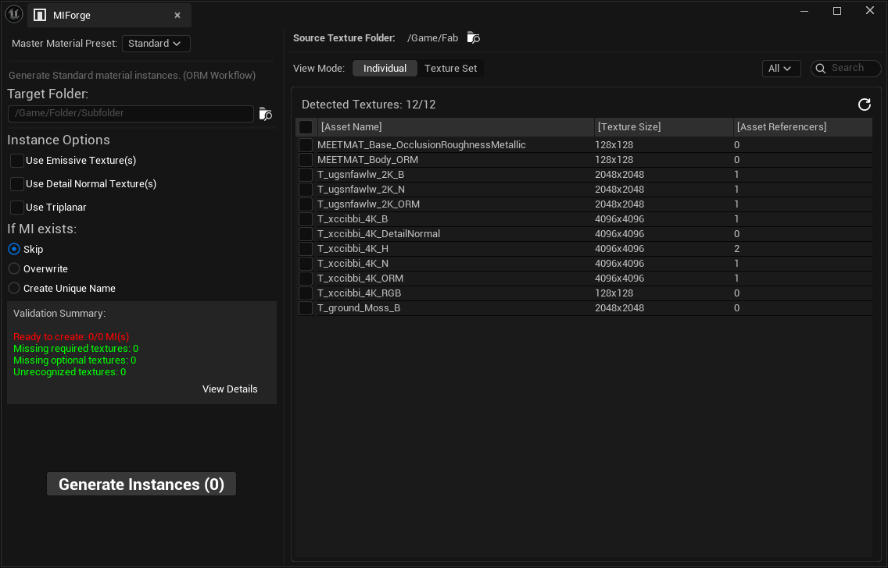
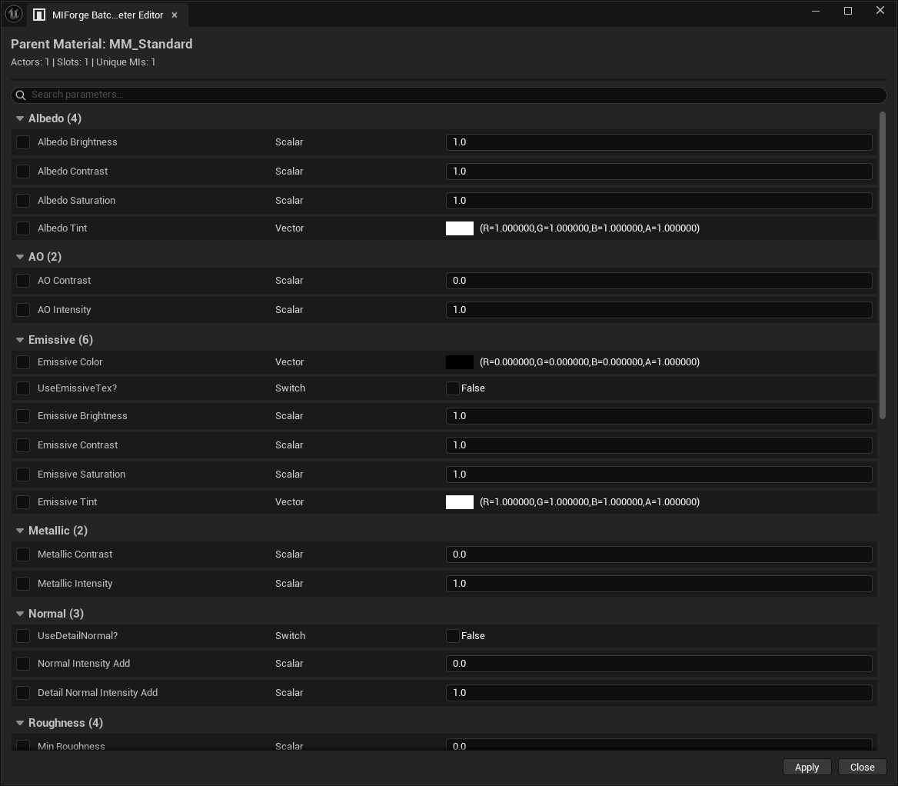

# MIForge

MIForge is an Unreal Engine Editor plugin that automates texture compression correction, texture validation, Material Instance generation, and batch Material Instance parameter editing.





## Overview

Creating Material Instances manually often involves repetitive texture assignment, compression checks, naming, validation, and parameter editing.

MIForge streamlines this workflow by scanning selected Content Browser folders, classifying textures by naming suffix, grouping them into texture sets, validating them against preset material requirements, and generating Material Instances in bulk.

## Key Features

- Texture discovery and suffix-based classification
- Texture-set grouping
- Standard Material Instance generation
- RGB Mask Material Instance generation
- Vertex Paint Material Instance generation
- Decal Material Instance generation
- Texture compression and sRGB correction
- Batch Material Instance parameter editing
- Vertex Paint recipe saving and loading
- Validation summaries and detailed error reporting
- Existing-asset handling: Skip, Overwrite, or Create Unique
- Transaction support and generated-asset Undo/Redo

## Supported Presets

### Standard

Supports common textures used in an ORM-based workflow, including:

- Albedo
- Normal
- ORM
- Emissive
- Detail Normal

Triplanar mapping is also supported when enabled.

### RGB Mask

Supported textures:

- Albedo
- Normal
- ORM
- RGB Mask
- Detail Normal

### Vertex Paint

Supported textures:

- Albedo
- Normal
- ORM
- Height

Supports up to four material layers: Base, R, G, and B, with optional height-based blending.

### Decal

Supported textures:

- Albedo
- Opacity
- Normal
- ORM

## Requirements

- Unreal Engine 5.6
- Windows 64-bit
- Supports both Blueprint-only and C++ Unreal projects

## Installation

1. Close Unreal Editor.
2. Copy the `MIForge` folder into your project's `Plugins` directory.

```text
YourProject/
└─ Plugins/
   └─ MIForge/
```

3. Enable MIForge from **Edit → Plugins** if it is not enabled automatically.
4. Restart Unreal Editor.

## Quick Start

1. Place textures inside a Content Browser folder.
2. Name the textures according to the configured MIForge suffix rules, for example: `T_Rock_Albedo`.
3. Right-click the folder in the Content Browser.
4. Select **Open MIForge**.
5. Choose a preset.
6. Select the detected texture sets.
7. Choose an output folder.
8. Click **Generate Material Instances**.

Before integrating MIForge into your project workflow, please review `MIForge_Conventions.md` in the `/Doc` folder for naming conventions, preset-specific requirements, and known workflow considerations.

## Known Limitations

- MIForge has been developed and tested primarily with Unreal Engine 5.6.
- Custom master materials cannot currently be configured as user-defined presets.
- The Batch Parameter Editor modifies shared Material Instance assets directly.
- Generated-asset Undo/Redo has not been validated against every extreme rapid-repeat case.
- Modified assets are marked dirty but are not automatically saved.
- Texture Compression Fix should not be assumed to provide complete transactional Undo.
- Very large folders may introduce delays because scanning is currently synchronous.

## Architecture

MIForge uses a layered editor architecture:

```text
Slate UI
→ ViewModel and Texture Catalog
→ Validation and Generation Services
→ Unreal Editor APIs
→ Material Instance generation is divided into planning, conflict resolution, execution, and preset-specific parameter application.
```

See `Architecture.md` in the `/Doc` folder for more details.

## Future Plan

The long-term goal of MIForge is to support user-defined master materials as custom generation presets, alongside a built-in preset library.

A future configuration system may allow artists or technical artists to map custom master-material parameters directly through MIForge settings, providing greater flexibility for batch Material Instance generation.

## Postscript

The current version is intended as a portfolio and testing release rather than a commercial production plugin.